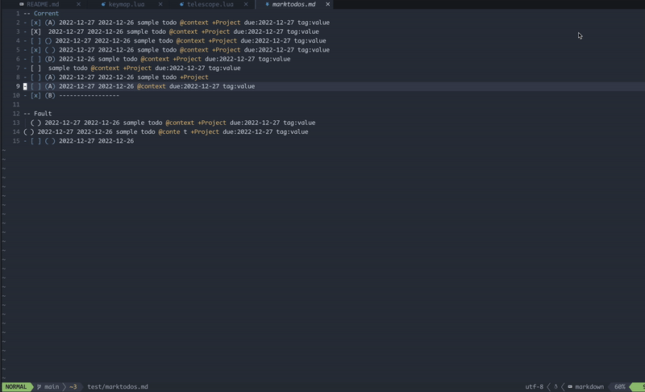
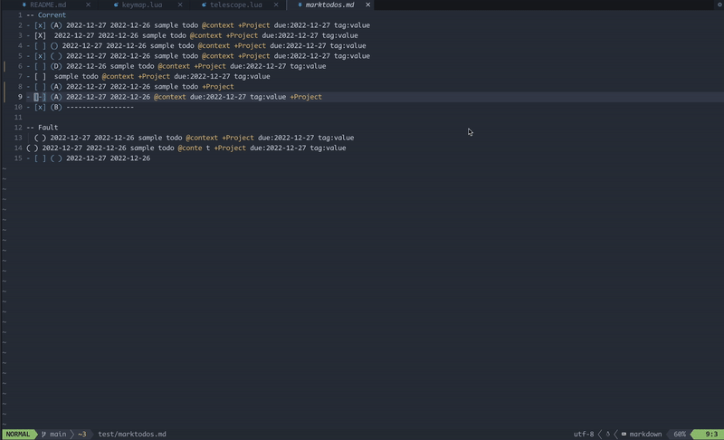
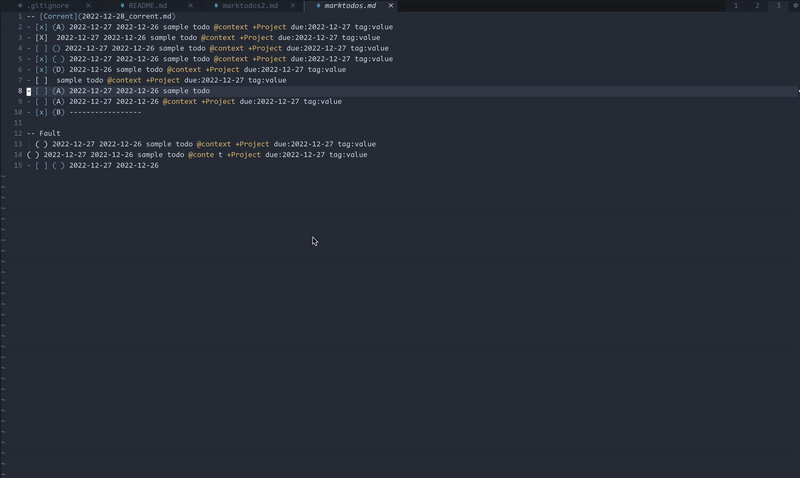
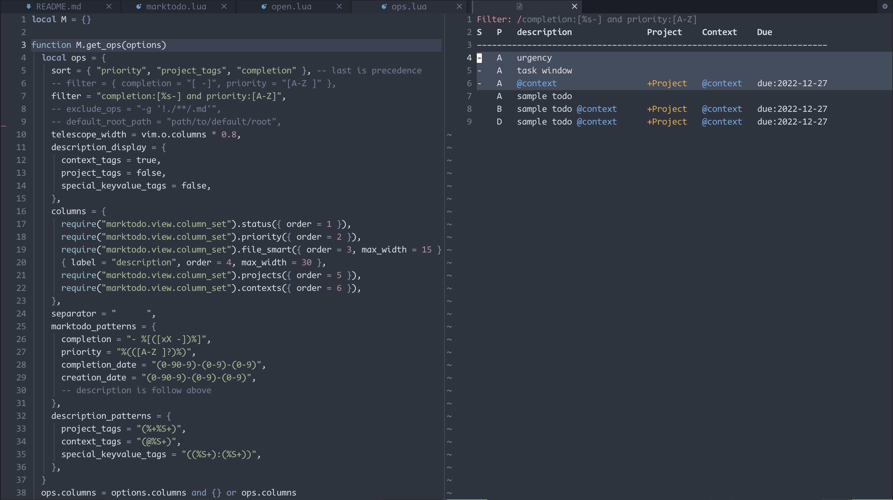
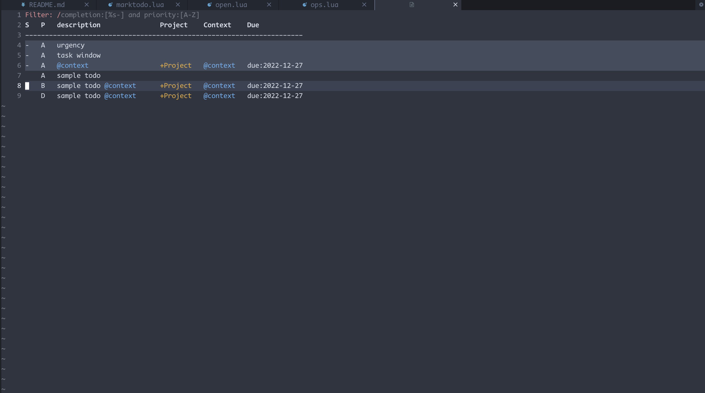

# Marktodo
Task manager inpired by [todotxt](https://ericasadun.com/2019/11/13/lightweight-to-do-list-formatting/)!!

You can search todo written by [todotxt](https://ericasadun.com/2019/11/13/lightweight-to-do-list-formatting/) format from all files in your current directory.

You can search and list tasks created in multiple files with markdown files using.

The listed tasks are displayed with information such as title, file name, and PRIORITY information.

A sorting function is also implemented.

## Demo
### Window style


### Telescope style


## Requirements
- ripgrep

optional
- nvim-cmp
- telescope.nvim

## Instllation
Using packer
```
use({
	"/arakkkkk/marktodo.nvim",
	config = function()
		require("marktodo").setup()
	end,
})
```

## Usage

### Create ToDo
```
1---- 2-- 3--------- 4--------- 5-----------------------------------------------------
- [x] (A) 2022-12-27 2022-12-26 sample todo @context +Project due:2022-12-27 tag:value
                                            6------- 7------- 8------------- 8--------
```
1. Marktodo Picker
2. Priority (Optional)
3. Completion Date (Optional)
4. Creation Date (Optional)
5. Description
6. Context Tag (Optional)
7. Project Tag (Optional)
8. Special key/value tag (Optional)

## List todo with window
### Start
```
# float|full|right|left|top|bottom
:Marktodo right
```

or
```
:Marktodo full root_path=~/path/to/find
```

### Keymap
| Key    | Action                       | Command            |
| ------ | ---------------------------- | ------------------ |
| d      | Complete task at the cursor. | `:TodoComplete`    |
| -      | Start task at the cursor.    | `:TodoProgress`    |
| f      | Filter tasks.                | `:TodoFilter`      |
| \<CR\> | Open task buffer.            |    `:TodoOpen`     |
| p      | Set task priority.           | `:TodoSetPriority` |
| +      | Set task projects.           | `:TodoSetProject`  |
| D      | Set task due.                | `:TodoSetDue`      |
| m      | Modify task.                 | `:TodoModify`      |

## List todo with nvim-telescope
### Start
```
:Marktodo telescope
```
or
```
:Marktodo telescope root_path=~/path/to/find
```
or
```
require("marktodo").telescope("~/path/to/find")
```

If find path is nil or not set, default_root_path in setup options is used.

Open files contain selected todo with <CR>.

Complete task from telescope window with <C-d>.
### Keymap
| Key     | Action            |
| ------- | ----------------- |
| \<CR\>  | Open task buffer. |
| \<C-o\> | Start task.       |
| \<C-b\> | Uncomplete task.  |
| \<C-d\> | Complete task.    |

## Settings
### Set up opsions
```
require("marktodo").setup({
	sort = { "priority", "project_tags", "completion" }, -- last is precedence
	filter = "completion:[%s-] and priority:[A-Z]",
	-- exclude_ops = "-g '!./**/.md'",
	-- default_root_path = "path/to/default/root",
	telescope_width = vim.o.columns * 0.8,
	description_display = {
		context_tags = true,
		project_tags = false,
		special_keyvalue_tags = false,
	},
	columns = {
		require("marktodo.view.column_set").status({ order = 1 }),
		require("marktodo.view.column_set").priority({ order = 2 }),
		require("marktodo.view.column_set").file_smart({ order = 3, max_width = 15 }),
		{ label = "description", order = 4, max_width = 30 },
		require("marktodo.view.column_set").projects({ order = 5 }),
		require("marktodo.view.column_set").contexts({ order = 6 }),
	},
	separator = "      ",
	marktodo_patterns = {
		completion = "- %[([xX -])%]",
		priority = "%(([A-Z ]?)%)",
		completion_date = "([0-9][0-9][0-9][0-9])-([0-9][0-9])-([0-9][0-9])",
		creation_date = "([0-9][0-9][0-9][0-9])-([0-9][0-9])-([0-9][0-9])",
		-- description is follow above
	},
	description_patterns = {
		project_tags = "(%+%S+)",
		context_tags = "(@%S+)",
		special_keyvalue_tags = "((%S+):(%S+))",
	}
}
```
### Set telescope columns
### Completion with nvim-cmp
```lua
use({"hrsh7th/nvim-cmp"})

require('cmp').setup({
  sources = {
    { name = 'marktodo' },
  },
})
```
- [x] check box
- [x] priority
- [x] project
- [x] tag
- [ ] due date

## Inspired by
- [obsidian-tasks](https://github.com/obsidian-tasks-group/obsidian-tasks)
- [todo.txt](https://github.com/todotxt/todo.txt)
- [todo.md](https://github.com/todomd/todo.md)

## Issues
- [x] todoparser
- [x] todofinder
- [ ] cmp for due
- [X] todoevents
- [ ] Sort by due
- [X] Sort by created
- [-] (A) urgency due:2023-02-02
- [x] (A) task window
	- [x] ops setup
	- [x] color highlisht
	- [ ] add documents
	- [x] split window
	- [ ] preview
	- [ ] switch by projects
	- [ ] 下の必要な行をそれに書き換える
